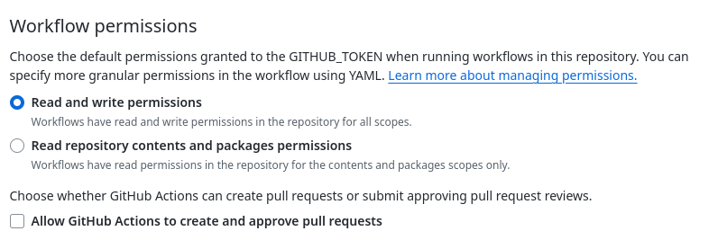

# MkDocs

> MkDocs is a fast, simple and downright gorgeous static site generator that's geared towards building project documentation. Documentation source files are written in Markdown, and configured with a single YAML configuration file.

To set up MkDocs in our Project we need to:

1. Configure MkDocs 
2. Documentation files
3. Github workflow
4. Github workflow permissions
5. Commit and push to Github
6. Confirm the action ran on Github 
7. Set the Github Repository to use Github Pages

## 1. Configure MkDocs

The first thing we need to do is create the configuration file `mkdocs.yaml` in the root of the repository.

```sh 
touch mkdocs.yaml 
```

Add the base configuration to `./mkdocs.yaml` 

```yaml
# ./mkdocs.yaml
site_name: Personal Ledger Documentation
site_url: https://ianteda.github.io/Personal_Ledger
docs_dir: 'docs'
theme:
  name: 'material'
nav:
  - Home: README.md
  - About: about.md
plugins:
  - search
  - neoteroi.mkdocsoad:
      use_pymdownx: true
markdown_extensions:
  - pymdownx.details
  - pymdownx.superfences
  - pymdownx.tabbed:
      alternate_style: true
extra_css:
  - css/neoteroi-mkdocsoad.css
```

Add the [custom css](https://github.com/IanTeda/REST-API-Server/blob/main/docs/css/neoteroi-mkdocs.css) file `~./docs/css/neoteroi-mkdocs.css`

## 2. Documentation Files

In the configuration above we set two navigations (pages) Home `readme.md` and About `about.md`, we now need to create these

```markdown 
# REST API Server

This is the document website for [REST API Server](https://github.com/IanTeda/REST-API-Server)

## Table of Contents

1. [Home](https://ianteda.github.io/REST-API-Server/)
2. [About](./about.md)

```

```markdown 
# About Rest API Server

## Road Map

### Short Term

### Long Term
```

## 3. Github Workflow 

Next we need to set up the Github work flows to use two Github actions then run two commands to install MkDoc program files and then execute MkDocs 

```yaml 
# ./github/workflows/mkdocs.yaml
name: mkdocs
on:
  push:
    branches: 
      - main
jobs:
  deploy:
    runs-on: ubuntu-latest
    steps:
      - uses: actions/checkout@v4
      - uses: actions/setup-python@v4
        with:
          python-version: 3.x
      # Need to install `mkdocs` and theme `mkdocs-windmill` set in `./mkdocs.yaml` config
      - run: pip install mkdocs mkdocs-material neoteroi-mkdocs pymdown-extensions
      # Repository > Settings > Actions > General > Workflow permissions > Read and write permissions
      - run: mkdocs gh-deploy --force --clean --verbose

# Repository > Settings > Pages > Build and deployment > Branch > gh-pages

## References
# https://github.com/Neoteroi/mkdocs-plugins
```

## 4. Github Workflow Permissions

Let's allow actions to write to the `gh-pages` branch through Repository Settings > Actions > General > Workflow permissions

Then allow Read and write permissions



## 5. Commit and Push to Github 

Now we need to add and commit the repository before pushing to Github

```sh 
git add .
```

```sh 
git commit -m "First MkDocs commit"
```

```sh 
git push
```

## 6. Confirm Github Action 

Now that we have pushed to Github lets confirm the workflow executed ok, by going to Actions > All Workflows. 


## 7. Set the Github Repository to use Github Pages 

We set up pages by going to the Repository Settings > Pages > Build and deployment > Branch.

Then set the branch to `gh-pages`.


### Repository Website Link

Set the Repository website by updating the About details for the repository and selecting `Use your Github Pages website`.

#### References

* [Mkdocs](https://www.mkdocs.org/)
