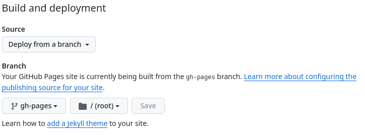

# MkDocs

> MkDocs is a fast, simple and downright gorgeous static site generator that's geared towards building project documentation. Documentation source files are written in Markdown, and configured with a single YAML configuration file.

## Set Up

To set up MkDocs within the repository we need to set the Github Pages branch and allow read and write for Github Actions.

### Github Pages

We set up pages by going to the Repository Settings > Pages > Build and deployment > Branch.

Then set the branch to `gh-pages`.

### Github Actions

Let's allow actions to write to the `gh-pages` branch through Repository Settings > Actions > General > Workflow permissions

Then allow Read and write permissions

### Repository Website Link

Set the Repository website by updating the About details for the repository and selecting `Use your Github Pages website`.

## Usage

To add documentation, create a new markdown file in the `./docs` folder. Once add you can include it in the menu by including it in `nav` option in `./mkdocs.yaml`.

Add content to the markdown file, then push it to Github. The Github action will then create the MkDocs site files within `gh-pages`.

## Under the Hood

A Github action stored in `./.github/workflows/mkdocs.yaml` and uses Ubuntu as its base and two actions:

1. [actions/checkout@v4](https://github.com/actions/checkout)
2. [actions/setup-python@v4](https://github.com/actions/setup-python)

__Checkout__ is used to get into the gh-pages branch and __Python__ is used to install, run mkdocs and push to gh-pages.

#### References

* [Mkdocs](https://www.mkdocs.org/)
